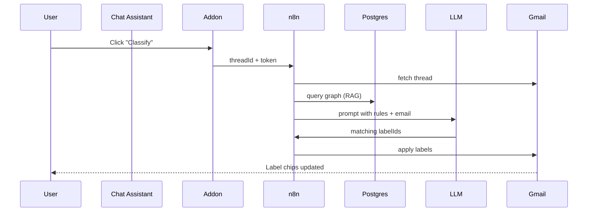

# 2. Architecture

### Component Responsibilities

* **Add-on (Apps Script)**
  – Contextual card, sidebar, OAuth flow

* **Chat Assistant (LLM)**  
  – Lives inside the add-on sidebar  
  – Transforms user utterances into graph mutations or on-demand queries  

* **n8n workflow**
  – HTTP trigger, Gmail nodes, PG nodes, error-handling, retry

* **LLM agent**
  – Converts NL rules → edges, evaluates classification

Detailed node list and env-vars live in `/n8n/export.json`.