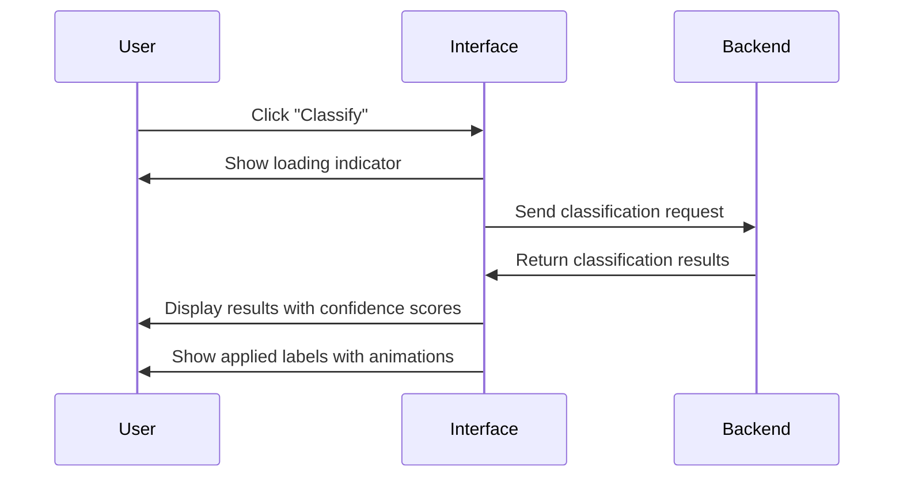
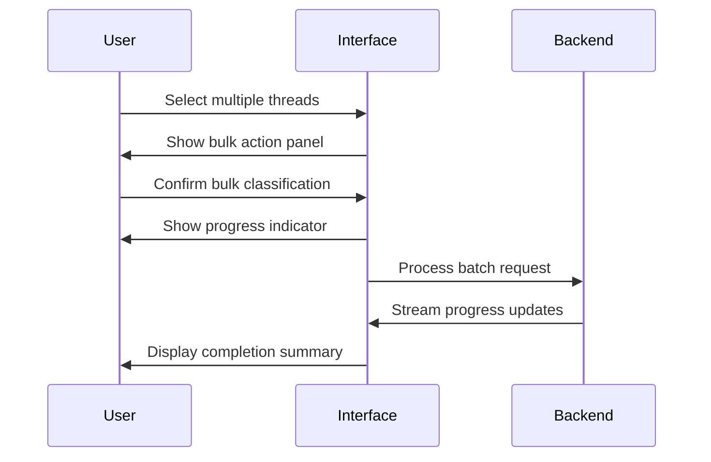

# 11. UI/UX Design Guidelines

## Overview

This document establishes comprehensive design standards for the Gmail Graph-Classifier Add-on, ensuring a professional, accessible, and consistent user experience through Microsoft Fluent UI implementation.

## Design Philosophy

### Core Principles
- **Professional Excellence**: Enterprise-grade visual design that inspires confidence
- **Cognitive Clarity**: Reduce mental load through intuitive information hierarchy
- **Operational Efficiency**: Streamlined workflows for maximum productivity
- **Universal Accessibility**: Inclusive design that serves all users effectively

### Design System Foundation
- **Framework**: Microsoft Fluent UI 2.0
- **Theme**: Standard Fluent UI theme with enterprise customizations
- **Typography**: Segoe UI Variable font family
- **Color System**: Fluent UI semantic color tokens
- **Iconography**: Fluent UI System Icons

---

## Visual Design Standards

### Color Palette

#### Primary Colors
```css
--colorBrandBackground: #0F6CBD;     /* Primary brand blue */
--colorBrandBackgroundHover: #115EA3; /* Primary hover state */
--colorBrandBackgroundPressed: #0E4775; /* Primary pressed state */
--colorBrandForeground1: #0F6CBD;    /* Primary text/icons */
--colorBrandForeground2: #2B88D8;    /* Secondary brand elements */
```

#### Semantic Colors
```css
--colorNeutralBackground1: #FFFFFF;   /* Primary surface */
--colorNeutralBackground2: #FAFAFA;   /* Secondary surface */
--colorNeutralBackground3: #F5F5F5;   /* Tertiary surface */
--colorNeutralForeground1: #242424;   /* Primary text */
--colorNeutralForeground2: #616161;   /* Secondary text */
--colorNeutralForeground3: #C8C8C8;   /* Disabled/placeholder text */
```

#### Status Colors
```css
--colorPaletteGreenForeground1: #107C10;  /* Success states */
--colorPaletteRedForeground1: #D13438;    /* Error states */
--colorPaletteYellowForeground1: #FDE047; /* Warning states */
--colorPaletteBlueForeground1: #0F6CBD;   /* Information states */
```

### Typography Scale

#### Heading Hierarchy
```css
.text-title-1 {
  font-family: 'Segoe UI Variable';
  font-size: 28px;
  font-weight: 600;
  line-height: 36px;
  color: var(--colorNeutralForeground1);
}

.text-title-2 {
  font-family: 'Segoe UI Variable';
  font-size: 20px;
  font-weight: 600;
  line-height: 26px;
  color: var(--colorNeutralForeground1);
}

.text-title-3 {
  font-family: 'Segoe UI Variable';
  font-size: 16px;
  font-weight: 600;
  line-height: 22px;
  color: var(--colorNeutralForeground1);
}
```

#### Body Text
```css
.text-body-1 {
  font-family: 'Segoe UI Variable';
  font-size: 14px;
  font-weight: 400;
  line-height: 20px;
  color: var(--colorNeutralForeground1);
}

.text-body-2 {
  font-family: 'Segoe UI Variable';
  font-size: 12px;
  font-weight: 400;
  line-height: 16px;
  color: var(--colorNeutralForeground2);
}

.text-caption-1 {
  font-family: 'Segoe UI Variable';
  font-size: 11px;
  font-weight: 400;
  line-height: 14px;
  color: var(--colorNeutralForeground2);
}
```

### Spacing System

#### Spatial Units
```css
--spacingHorizontalNone: 0px;
--spacingHorizontalXXS: 2px;
--spacingHorizontalXS: 4px;
--spacingHorizontalSNudge: 6px;
--spacingHorizontalS: 8px;
--spacingHorizontalMNudge: 10px;
--spacingHorizontalM: 12px;
--spacingHorizontalL: 16px;
--spacingHorizontalXL: 20px;
--spacingHorizontalXXL: 24px;
--spacingHorizontalXXXL: 32px;
```

---

## Component Architecture

### Primary Interface Components

#### 1. Header Bar
```typescript
interface HeaderBarProps {
  title: string;
  subtitle?: string;
  actions?: HeaderAction[];
  navigationState?: 'default' | 'contextual';
}
```

**Implementation Standards:**
- Fixed height: 48px
- Background: `--colorNeutralBackground1`
- Border bottom: 1px solid `--colorNeutralStroke2`
- Title typography: `text-title-3`
- Action buttons: 32x32px with 8px margin

#### 2. Chat Interface Panel
```typescript
interface ChatPanelProps {
  messages: ChatMessage[];
  inputState: 'idle' | 'typing' | 'processing';
  placeholder: string;
  maxHeight?: string;
}
```

**Design Specifications:**
- Container: Full width with 12px horizontal padding
- Message bubbles: 8px border radius, 12px internal padding
- User messages: Right-aligned, brand background
- Assistant messages: Left-aligned, neutral background
- Input field: Minimum 40px height, expandable to 120px
- Send button: 32x32px, positioned absolute right

#### 3. Classification Results Card
```typescript
interface ClassificationCardProps {
  threadId: string;
  labels: AppliedLabel[];
  confidence: number;
  timestamp: Date;
  status: 'pending' | 'completed' | 'error';
}
```

**Visual Structure:**
- Card elevation: `shadow4`
- Border radius: 8px
- Internal padding: 16px
- Label chips: 6px border radius, 4px internal padding
- Status indicator: 8px circle, positioned top-right

#### 4. Rule Management Interface
```typescript
interface RuleManagerProps {
  rules: ClassificationRule[];
  activeFilters: FilterOptions;
  sortOrder: 'created' | 'modified' | 'name' | 'usage';
  viewMode: 'list' | 'grid';
}
```

**Layout Standards:**
- List view: 56px row height, alternating background
- Grid view: 280px card width, 16px gap
- Filter bar: 40px height, sticky positioning
- Action buttons: Consistent with Fluent UI button specifications

### Secondary Components

#### Status Indicators
- **Processing**: Spinner + "Classifying..." text
- **Success**: Checkmark + "Classification complete"
- **Warning**: Alert triangle + descriptive message
- **Error**: Error icon + actionable error message

#### Loading States
- **Skeleton screens** for initial data loading
- **Progressive loading** for large datasets
- **Shimmer effects** for individual components
- **Timeout handling** with retry mechanisms

---

## Interaction Patterns

### Conversational Interface

#### Chat Input Behavior
1. **Auto-resize**: Input field expands as user types (40px to 120px max)
2. **Send triggers**: Enter key (default) or click send button
3. **Typing indicators**: Show "Assistant is thinking..." during processing
4. **Message persistence**: Maintain conversation context across sessions

#### Response Handling
1. **Streaming responses**: Display partial responses as they're generated
2. **Error recovery**: Provide retry options for failed requests
3. **Context preservation**: Maintain conversation thread for follow-up questions
4. **Action suggestions**: Present quick-action buttons for common tasks

### Classification Workflow

#### Single Thread Classification


#### Bulk Classification


### Error Handling Patterns

#### Progressive Error Disclosure
1. **Level 1**: Inline error messages with corrective actions
2. **Level 2**: Modal dialogs for critical errors requiring user intervention
3. **Level 3**: Full-page error states for system-level failures

#### Recovery Mechanisms
- **Auto-retry**: For transient network errors (max 3 attempts)
- **Manual retry**: User-initiated retry with exponential backoff
- **Fallback modes**: Graceful degradation when services are unavailable
- **Offline support**: Cache recent classifications for offline viewing

---

## Accessibility Standards

### WCAG 2.1 AA Compliance

#### Color and Contrast
- **Text contrast**: Minimum 4.5:1 ratio for normal text
- **Large text contrast**: Minimum 3:1 ratio for 18pt+ text
- **Interactive elements**: Minimum 3:1 ratio for focus indicators
- **Color independence**: Information never conveyed by color alone

#### Keyboard Navigation
- **Tab order**: Logical sequence following visual layout
- **Focus indicators**: 2px solid border with 2px offset
- **Keyboard shortcuts**: Standard shortcuts plus custom accelerators
- **Skip links**: "Skip to main content" for screen reader users

#### Screen Reader Support
- **ARIA labels**: Comprehensive labeling for interactive elements
- **Live regions**: Dynamic content updates announced appropriately
- **Semantic markup**: Proper heading hierarchy and landmark roles
- **Alternative text**: Descriptive alt text for all informative images

#### Motor Accessibility
- **Target size**: Minimum 44x44px for touch targets
- **Timing**: No time limits on user interactions
- **Motion sensitivity**: Respect prefers-reduced-motion settings
- **Input methods**: Support for switch navigation and voice control

---

## Responsive Design Framework

### Breakpoint Strategy
```css
/* Gmail sidebar constraints */
@media (max-width: 320px) { /* Minimum sidebar width */ }
@media (min-width: 321px) and (max-width: 400px) { /* Standard sidebar */ }
@media (min-width: 401px) and (max-width: 500px) { /* Wide sidebar */ }
@media (min-width: 501px) { /* Expanded sidebar */ }
```

### Adaptive Layout Patterns

#### Component Scaling
- **Typography**: Fluid scaling within defined bounds
- **Spacing**: Proportional adjustment maintaining visual hierarchy
- **Touch targets**: Maintain 44px minimum regardless of screen size
- **Content density**: Adjust information density based on available space

#### Progressive Enhancement
1. **Core functionality**: Essential features work at minimum width
2. **Enhanced features**: Additional capabilities at wider breakpoints
3. **Advanced interactions**: Rich interactions for optimal viewing conditions
4. **Performance optimization**: Conditional loading based on viewport size

---

## Implementation Guidelines

### Development Standards

#### CSS Architecture
```css
/* Fluent UI CSS Custom Properties integration */
:root {
  /* Import Fluent UI design tokens */
  @import '@fluentui/tokens/global.css';
}

/* Component-specific custom properties */
.gmail-classifier-addon {
  --addon-sidebar-width: 320px;
  --addon-max-content-width: 480px;
  --addon-animation-duration: 200ms;
  --addon-animation-easing: cubic-bezier(0.33, 0, 0.67, 1);
}
```

#### Component Structure
```typescript
// Standard component interface
interface FluentUIComponentProps {
  className?: string;
  id?: string;
  'aria-label'?: string;
  'aria-describedby'?: string;
  disabled?: boolean;
  size?: 'small' | 'medium' | 'large';
  appearance?: 'primary' | 'secondary' | 'subtle';
}
```

#### Animation Standards
- **Entrance animations**: Fade in with 200ms duration
- **Exit animations**: Fade out with 150ms duration  
- **Transform animations**: Scale and translate with ease-out timing
- **State transitions**: Color and opacity changes with 100ms duration

### Quality Assurance

#### Visual Testing
- **Pixel-perfect alignment**: 1px precision for all UI elements
- **Cross-browser compatibility**: Chrome, Firefox, Safari, Edge support
- **High DPI displays**: Crisp rendering at 1x, 1.5x, 2x, and 3x scaling
- **Print styling**: Optimized layouts for print media

#### Performance Metrics
- **First Contentful Paint**: < 1.5 seconds
- **Largest Contentful Paint**: < 2.5 seconds
- **Cumulative Layout Shift**: < 0.1
- **First Input Delay**: < 100 milliseconds

#### Usability Testing
- **Task completion rate**: > 95% for primary workflows
- **Error recovery**: < 30 seconds average recovery time
- **User satisfaction**: > 4.5/5.0 on standardized usability scales
- **Accessibility compliance**: 100% WCAG 2.1 AA conformance

---

## Brand Integration

### Microsoft Fluent UI Alignment
- **Design tokens**: Full integration with Fluent UI design system
- **Component library**: Exclusive use of official Fluent UI components
- **Theme consistency**: Seamless integration with Microsoft 365 ecosystem
- **Icon library**: Fluent UI System Icons for all interface elements

### Gmail Integration
- **Visual harmony**: Complementary design that respects Gmail's interface
- **Contextual relevance**: UI elements that enhance rather than distract
- **Performance consideration**: Minimal impact on Gmail's loading performance
- **Security compliance**: Full adherence to Google Workspace security standards

---

## Maintenance and Evolution

### Design System Updates
- **Token synchronization**: Automated updates when Fluent UI releases new tokens
- **Component deprecation**: Graceful handling of deprecated component patterns  
- **Feature flag integration**: Safe deployment of experimental design changes
- **User feedback integration**: Systematic collection and implementation of user suggestions

### Documentation Standards
- **Living documentation**: Automatically generated component documentation
- **Usage examples**: Comprehensive code samples for each component
- **Accessibility guidelines**: Detailed implementation instructions for accessibility features
- **Performance benchmarks**: Regular monitoring and reporting of key metrics