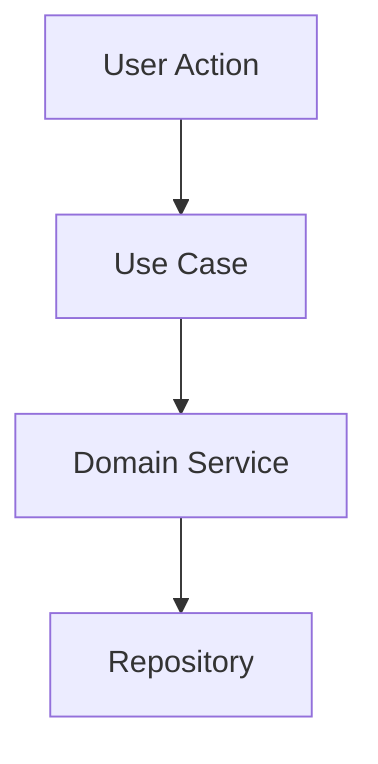

# 12. Coding Practices & Standards

## Overview

This document establishes comprehensive coding standards designed for enterprise-grade development with LLM-assisted workflows. Our architecture prioritizes atomic components, 100% test coverage, and documentation optimized for AI context management.

## Core Development Philosophy

### Principles
- **Test-Driven Development (TDD)**: All code written with tests first, achieving 100% coverage
- **Atomic Component Design**: Single responsibility, maximum reusability, minimal dependencies
- **LLM-Optimized Documentation**: Structured for efficient AI context parsing and reasoning
- **Incremental Complexity**: Simple foundations building to complex behaviors
- **Immutable Patterns**: Favor immutability and functional programming principles

### Quality Gates
- **Code Coverage**: 100% line, branch, and function coverage mandatory
- **Type Safety**: Strict TypeScript configuration with zero `any` types
- **Documentation Coverage**: Every public API documented with examples
- **Performance Budgets**: Sub-100ms response times for UI interactions
- **Accessibility Compliance**: WCAG 2.1 AA standards for all components

---

## Test-Driven Development Framework

### TDD Workflow (Red-Green-Refactor)

#### Phase 1: Red (Write Failing Test)
```typescript
// Example: Classification rule validation
describe('ClassificationRule', () => {
  describe('validate', () => {
    it('should reject rule with empty name', () => {
      // Arrange
      const rule = new ClassificationRule({
        name: '',
        description: 'Valid description',
        pattern: { type: 'graph', nodes: [] }
      });

      // Act & Assert
      expect(() => rule.validate()).toThrow('Rule name cannot be empty');
    });
  });
});
```

#### Phase 2: Green (Write Minimal Implementation)
```typescript
// src/domain/ClassificationRule.ts
export class ClassificationRule {
  constructor(private config: RuleConfig) {}
  
  validate(): void {
    if (!this.config.name?.trim()) {
      throw new Error('Rule name cannot be empty');
    }
  }
}
```

#### Phase 3: Refactor (Improve Code Quality)
```typescript
// Refactored with proper validation patterns
export class ClassificationRule {
  private readonly name: string;
  private readonly description: string;
  private readonly pattern: RulePattern;

  constructor(config: RuleConfig) {
    this.validate(config);
    this.name = config.name.trim();
    this.description = config.description.trim();
    this.pattern = config.pattern;
  }

  private validate(config: RuleConfig): void {
    const errors: string[] = [];
    
    if (!config.name?.trim()) {
      errors.push('Rule name cannot be empty');
    }
    
    if (!config.description?.trim()) {
      errors.push('Rule description cannot be empty');
    }
    
    if (errors.length > 0) {
      throw new ValidationError(errors);
    }
  }
}
```

### Coverage Requirements

#### Mandatory Coverage Metrics
```json
{
  "jest": {
    "coverageThreshold": {
      "global": {
        "branches": 100,
        "functions": 100,
        "lines": 100,
        "statements": 100
      }
    },
    "collectCoverageFrom": [
      "src/**/*.{ts,tsx}",
      "!src/**/*.d.ts",
      "!src/**/*.stories.tsx",
      "!src/**/*.test.{ts,tsx}"
    ]
  }
}
```

#### Test Categories & Requirements

##### Unit Tests (Isolated Components)
```typescript
// Every function must have comprehensive unit tests
describe('EmailClassifier', () => {
  describe('classifyThread', () => {
    it('should classify thread with single matching rule', async () => {
      // Isolated test with mocked dependencies
    });
    
    it('should handle multiple matching rules with priority', async () => {
      // Test rule precedence logic
    });
    
    it('should return empty labels for non-matching thread', async () => {
      // Test negative case
    });
    
    it('should handle malformed email data gracefully', async () => {
      // Test error handling
    });
  });
});
```

##### Integration Tests (Component Interactions)
```typescript
// Test component interactions without external dependencies
describe('ClassificationWorkflow Integration', () => {
  it('should complete end-to-end classification workflow', async () => {
    // Test full workflow with real components, mocked external services
  });
});
```

##### End-to-End Tests (Full System)
```typescript
// Test complete user workflows
describe('Gmail Classification E2E', () => {
  it('should classify email through complete user workflow', async () => {
    // Test with real Gmail API, real database, real LLM calls
  });
});
```

---

## Atomic Component Architecture

### Component Design Principles

#### Single Responsibility
```typescript
// ❌ BAD: Multiple responsibilities
export class EmailProcessorAndClassifierAndLabeler {
  processEmail() { /* email parsing */ }
  classifyContent() { /* AI classification */ }
  applyLabels() { /* Gmail API calls */ }
}

// ✅ GOOD: Single responsibility per component
export class EmailProcessor {
  process(rawEmail: RawEmailData): ProcessedEmail { }
}

export class ContentClassifier {
  classify(content: ProcessedEmail): ClassificationResult { }
}

export class LabelApplicator {
  applyLabels(threadId: string, labels: Label[]): Promise<void> { }
}
```

#### Immutable Data Patterns
```typescript
// All domain objects are immutable
export class EmailThread {
  readonly id: ThreadId;
  readonly messages: ReadonlyArray<EmailMessage>;
  readonly labels: ReadonlyArray<Label>;
  readonly metadata: EmailMetadata;

  constructor(data: EmailThreadData) {
    this.id = data.id;
    this.messages = Object.freeze([...data.messages]);
    this.labels = Object.freeze([...data.labels]);
    this.metadata = Object.freeze({ ...data.metadata });
  }

  withNewLabel(label: Label): EmailThread {
    return new EmailThread({
      ...this,
      labels: [...this.labels, label]
    });
  }
}
```

#### Dependency Injection
```typescript
// Constructor-based dependency injection
export class ClassificationService {
  constructor(
    private readonly emailProcessor: EmailProcessor,
    private readonly contentClassifier: ContentClassifier,
    private readonly labelApplicator: LabelApplicator,
    private readonly auditLogger: AuditLogger
  ) {}

  async classifyThread(threadId: string): Promise<ClassificationResult> {
    const processed = await this.emailProcessor.process(threadId);
    const classification = await this.contentClassifier.classify(processed);
    await this.labelApplicator.applyLabels(threadId, classification.labels);
    await this.auditLogger.log(classification);
    
    return classification;
  }
}
```

### Component Hierarchy Standards

#### Domain Layer (Business Logic)
```
src/domain/
├── entities/           # Core business entities
│   ├── EmailThread.ts
│   ├── ClassificationRule.ts
│   └── Label.ts
├── value-objects/      # Immutable value types
│   ├── ThreadId.ts
│   ├── EmailAddress.ts
│   └── Confidence.ts
├── services/          # Domain services
│   ├── ClassificationService.ts
│   └── RuleEvaluationService.ts
└── repositories/      # Data access interfaces
    ├── ThreadRepository.ts
    └── RuleRepository.ts
```

#### Application Layer (Use Cases)
```
src/application/
├── use-cases/         # Application-specific logic
│   ├── ClassifyThreadUseCase.ts
│   ├── CreateRuleUseCase.ts
│   └── BulkClassifyUseCase.ts
├── dto/              # Data transfer objects
│   ├── ClassificationRequest.ts
│   └── ClassificationResponse.ts
└── ports/            # External service interfaces
    ├── GmailApiPort.ts
    └── LlmServicePort.ts
```

#### Infrastructure Layer (External Concerns)
```
src/infrastructure/
├── adapters/         # External service implementations
│   ├── GmailApiAdapter.ts
│   ├── OpenAiAdapter.ts
│   └── PostgresAdapter.ts
├── repositories/     # Repository implementations
│   ├── PostgresThreadRepository.ts
│   └── PostgresRuleRepository.ts
└── config/          # Configuration management
    └── AppConfig.ts
```

#### Presentation Layer (UI Components)
```
src/presentation/
├── components/       # Atomic UI components
│   ├── atoms/        # Basic UI elements
│   ├── molecules/    # Component combinations
│   └── organisms/    # Complex UI sections
├── pages/           # Top-level application views
├── hooks/           # React custom hooks
└── contexts/        # React context providers
```

---

## LLM-Optimized Documentation Structure

### File Organization for Context Management

#### Maximum File Size Guidelines
- **Code files**: 200 lines maximum (excluding tests)
- **Documentation files**: 500 lines maximum
- **Test files**: 300 lines maximum
- **Configuration files**: 100 lines maximum

#### Naming Conventions for AI Navigation
```
# Feature-based organization
src/features/
├── classification/
│   ├── README.md              # Feature overview (< 200 lines)
│   ├── domain/
│   │   ├── ClassificationRule.ts      # Single class per file
│   │   ├── ClassificationRule.test.ts # Comprehensive tests
│   │   └── ClassificationRule.md      # Component documentation
│   ├── use-cases/
│   │   ├── ClassifyThread.ts
│   │   ├── ClassifyThread.test.ts
│   │   └── ClassifyThread.md
│   └── adapters/
│       ├── LlmClassifier.ts
│       ├── LlmClassifier.test.ts
│       └── LlmClassifier.md
```

#### Context-Optimized Documentation Template
```markdown
# ComponentName

## Purpose
Single sentence describing component's primary responsibility.

## Interface
```typescript
// Complete TypeScript interface with JSDoc
interface ComponentInterface {
  /** Primary method description */
  primaryMethod(param: ParamType): ReturnType;
}
```

## Dependencies
- `dependency1`: Brief description of why needed
- `dependency2`: Brief description of why needed

## Usage Example
```typescript
// Minimal, focused example
const component = new ComponentName(dependencies);
const result = component.primaryMethod(input);
```

## Test Coverage
- ✅ Happy path scenarios
- ✅ Edge cases
- ✅ Error conditions
- ✅ Performance requirements

## Related Components
- `RelatedComponent1`: How they interact
- `RelatedComponent2`: How they interact
```

### Feature README Template

Each feature directory contains a comprehensive README:

```markdown
# Feature: [Feature Name]

## Overview
Brief description of feature purpose and business value.

## Architecture


## Components
| Component | Responsibility | Dependencies |
|-----------|----------------|--------------|
| `UseCase` | Orchestrates feature workflow | Domain services |
| `DomainService` | Business logic implementation | Repositories |
| `Repository` | Data persistence abstraction | Infrastructure |

## API Surface
### Public Methods
- `executeFeature(input: Input): Promise<Output>`
  - Purpose: Primary feature execution
  - Validation: Input validation rules
  - Errors: Possible error conditions

## Testing Strategy
- **Unit Tests**: 15 test cases covering all branches
- **Integration Tests**: 5 test cases for component interaction
- **E2E Tests**: 2 test cases for complete user workflows

## Performance Characteristics
- **Latency**: < 200ms for typical requests
- **Memory**: < 10MB peak usage
- **Throughput**: 100 requests/second sustained

## Change Log
### Version 1.0.0 (2025-01-15)
- Initial implementation
- Core classification logic
- Basic error handling

### Version 1.1.0 (2025-01-22)
- Added batch processing support
- Improved error messages
- Performance optimizations
```

---

## Code Organization Standards

### Directory Structure
```
gmail-classifier/
├── README.md                    # Project overview
├── docs/                       # High-level documentation
├── src/
│   ├── features/              # Feature-based organization
│   │   ├── classification/
│   │   │   ├── README.md      # Feature documentation
│   │   │   ├── domain/        # Business logic
│   │   │   ├── application/   # Use cases
│   │   │   ├── infrastructure/ # External adapters
│   │   │   └── presentation/  # UI components
│   │   ├── rule-management/
│   │   └── chat-interface/
│   ├── shared/                # Shared utilities
│   │   ├── types/             # Common TypeScript types
│   │   ├── utils/             # Pure utility functions
│   │   └── constants/         # Application constants
│   └── __tests__/             # Global test utilities
├── tests/
│   ├── unit/                  # Isolated component tests
│   ├── integration/           # Component interaction tests
│   └── e2e/                   # Full system tests
└── tools/
    ├── coverage/              # Coverage reporting tools
    ├── linting/               # Code quality tools
    └── documentation/         # Doc generation scripts
```

### File Naming Conventions

#### TypeScript Files
```
# PascalCase for classes and interfaces
EmailThread.ts              # Domain entity
ClassificationService.ts    # Domain service
ThreadRepository.ts         # Repository interface

# camelCase for functions and utilities
validateEmail.ts            # Utility function
formatConfidence.ts         # Helper function

# kebab-case for components and features
email-thread-card.tsx       # React component
classification-workflow.ts   # Feature workflow
```

#### Test Files
```
# Mirror source structure with .test suffix
EmailThread.test.ts         # Unit tests
ClassificationService.test.ts
email-thread-card.test.tsx

# Integration tests with .integration suffix
classification-workflow.integration.test.ts

# E2E tests with .e2e suffix
gmail-classification.e2e.test.ts
```

#### Documentation Files
```
# README.md for feature/module overview
classification/README.md
rule-management/README.md

# Component-specific documentation
EmailThread.md
ClassificationService.md
```

---

## Testing Strategies & Coverage

### Unit Testing Standards

#### Test Structure (AAA Pattern)
```typescript
describe('ClassificationService', () => {
  describe('classifyThread', () => {
    it('should apply highest confidence rule when multiple rules match', async () => {
      // Arrange
      const mockRules = [
        createMockRule({ confidence: 0.7, label: 'Low Priority' }),
        createMockRule({ confidence: 0.9, label: 'High Priority' })
      ];
      const mockThread = createMockThread();
      const service = new ClassificationService(mockDependencies);

      // Act
      const result = await service.classifyThread(mockThread.id);

      // Assert
      expect(result.appliedLabels).toEqual(['High Priority']);
      expect(result.confidence).toBe(0.9);
      expect(mockAuditLogger.log).toHaveBeenCalledWith(
        expect.objectContaining({
          threadId: mockThread.id,
          appliedLabels: ['High Priority'],
          confidence: 0.9
        })
      );
    });
  });
});
```

#### Mock Strategy
```typescript
// Create focused mocks for each dependency
const createMockEmailProcessor = (): jest.Mocked<EmailProcessor> => ({
  process: jest.fn().mockResolvedValue(mockProcessedEmail)
});

const createMockContentClassifier = (): jest.Mocked<ContentClassifier> => ({
  classify: jest.fn().mockResolvedValue(mockClassification)
});

// Factory functions for test data
const createMockThread = (overrides?: Partial<EmailThread>): EmailThread => ({
  id: new ThreadId('thread-123'),
  messages: [createMockMessage()],
  labels: [],
  metadata: createMockMetadata(),
  ...overrides
});
```

### Integration Testing Patterns

#### Component Interaction Testing
```typescript
describe('Classification Workflow Integration', () => {
  let container: DependencyContainer;
  let mockGmailApi: jest.Mocked<GmailApiAdapter>;
  let mockDatabase: TestDatabase;

  beforeEach(async () => {
    mockDatabase = await createTestDatabase();
    mockGmailApi = createMockGmailApi();
    
    container = createTestContainer({
      gmailApi: mockGmailApi,
      database: mockDatabase
    });
  });

  afterEach(async () => {
    await mockDatabase.cleanup();
  });

  it('should complete classification workflow with database persistence', async () => {
    // Arrange
    const threadId = 'test-thread-123';
    const classificationService = container.resolve(ClassificationService);
    
    await mockDatabase.insertRule(createTestRule());
    mockGmailApi.getThread.mockResolvedValue(createMockGmailThread());

    // Act
    const result = await classificationService.classifyThread(threadId);

    // Assert
    expect(result.success).toBe(true);
    
    const auditLog = await mockDatabase.getAuditLog(threadId);
    expect(auditLog).toBeDefined();
    expect(auditLog.appliedLabels).toEqual(result.appliedLabels);
  });
});
```

### End-to-End Testing Framework

#### Real System Integration
```typescript
describe('Gmail Classification E2E', () => {
  let testEnvironment: E2ETestEnvironment;

  beforeAll(async () => {
    testEnvironment = await setupE2EEnvironment({
      database: 'test_classification_db',
      gmailAccount: 'test-classifier@example.com',
      llmProvider: 'openai-test-key'
    });
  });

  afterAll(async () => {
    await testEnvironment.cleanup();
  });

  it('should classify real Gmail thread through complete workflow', async () => {
    // Arrange
    const testEmail = await testEnvironment.createTestEmail({
      subject: 'Authentication issue with Product Y',
      from: 'user@companyx.com',
      body: 'Having trouble logging into the authentication system'
    });

    const rule = await testEnvironment.createClassificationRule({
      name: 'Auth-CompanyX-ProdY',
      pattern: {
        company: 'CompanyX',
        topic: 'Authentication',
        project: 'Product Y'
      }
    });

    // Act
    const classification = await testEnvironment.classifyThread(testEmail.threadId);

    // Assert
    expect(classification.success).toBe(true);
    expect(classification.appliedLabels).toContain('Auth-CompanyX-ProdY');
    expect(classification.confidence).toBeGreaterThan(0.8);

    // Verify Gmail labels were actually applied
    const gmailThread = await testEnvironment.getGmailThread(testEmail.threadId);
    expect(gmailThread.labels).toContain('Auth-CompanyX-ProdY');
  });
});
```

---

## Quality Assurance Processes

### Pre-Commit Requirements

#### Automated Quality Gates
```json
{
  "husky": {
    "hooks": {
      "pre-commit": [
        "lint-staged",
        "npm run type-check",
        "npm run test:coverage",
        "npm run test:integration"
      ]
    }
  },
  "lint-staged": {
    "*.{ts,tsx}": [
      "eslint --fix",
      "prettier --write",
      "npm run test:unit -- --findRelatedTests"
    ],
    "*.md": [
      "markdownlint --fix",
      "prettier --write"
    ]
  }
}
```

#### Coverage Enforcement
```bash
#!/bin/bash
# scripts/enforce-coverage.sh

npm run test:coverage

COVERAGE=$(npx nyc report --reporter=json-summary | jq '.total.lines.pct')

if (( $(echo "$COVERAGE < 100" | bc -l) )); then
  echo "❌ Coverage is $COVERAGE%. Must be 100%."
  exit 1
fi

echo "✅ Coverage is $COVERAGE%. Requirements met."
```

### Code Review Standards

#### Review Checklist
- [ ] **Test Coverage**: 100% line/branch coverage achieved
- [ ] **Documentation**: All public APIs documented with examples
- [ ] **Type Safety**: No `any` types, strict TypeScript compliance
- [ ] **Atomic Design**: Single responsibility per component
- [ ] **Performance**: No regressions in benchmark tests
- [ ] **Accessibility**: WCAG 2.1 AA compliance for UI changes
- [ ] **LLM Compatibility**: Files under size limits, clear structure

#### Automated Review Tools
```yaml
# .github/workflows/code-quality.yml
name: Code Quality

on: [pull_request]

jobs:
  quality-gates:
    runs-on: ubuntu-latest
    steps:
      - uses: actions/checkout@v3
      
      - name: Setup Node.js
        uses: actions/setup-node@v3
        with:
          node-version: '18'
          cache: 'npm'
      
      - name: Install dependencies
        run: npm ci
      
      - name: Run type checking
        run: npm run type-check
      
      - name: Run linting
        run: npm run lint
      
      - name: Run unit tests with coverage
        run: npm run test:coverage
      
      - name: Verify 100% coverage
        run: ./scripts/enforce-coverage.sh
      
      - name: Run integration tests
        run: npm run test:integration
      
      - name: Check documentation coverage
        run: npm run docs:coverage
      
      - name: Validate file size limits
        run: ./scripts/validate-file-sizes.sh
```

### Continuous Integration Pipeline

#### Build & Test Stages
```yaml
# .github/workflows/ci.yml
name: CI Pipeline

on:
  push:
    branches: [main, develop]
  pull_request:
    branches: [main]

jobs:
  test:
    strategy:
      matrix:
        node-version: [18, 20]
        os: [ubuntu-latest, windows-latest, macOS-latest]
    
    runs-on: ${{ matrix.os }}
    
    steps:
      - uses: actions/checkout@v3
      
      - name: Setup Node.js ${{ matrix.node-version }}
        uses: actions/setup-node@v3
        with:
          node-version: ${{ matrix.node-version }}
          cache: 'npm'
      
      - name: Install dependencies
        run: npm ci
      
      - name: Run comprehensive test suite
        run: |
          npm run test:unit
          npm run test:integration
          npm run test:e2e
      
      - name: Upload coverage reports
        uses: codecov/codecov-action@v3
        with:
          file: ./coverage/lcov.info
          fail_ci_if_error: true
          
      - name: Performance benchmarks
        run: npm run benchmark
        
      - name: Security audit
        run: npm audit --audit-level=high
```

---

## Documentation Maintenance

### Automated Documentation Generation

#### API Documentation
```typescript
/**
 * Classifies email threads using AI-powered rule evaluation
 * 
 * @example
 * ```typescript
 * const classifier = new ClassificationService(dependencies);
 * const result = await classifier.classifyThread('thread-123');
 * console.log(result.appliedLabels); // ['High Priority', 'Auth Issue']
 * ```
 * 
 * @param threadId - Unique identifier for Gmail thread
 * @returns Promise resolving to classification results with applied labels
 * @throws {ValidationError} When threadId is invalid
 * @throws {AuthenticationError} When Gmail API access denied
 */
export async classifyThread(threadId: string): Promise<ClassificationResult> {
  // Implementation
}
```

#### Documentation Generation Pipeline
```json
{
  "scripts": {
    "docs:generate": "typedoc src --out docs/api --readme README.md",
    "docs:validate": "markdownlint docs/**/*.md",
    "docs:coverage": "./scripts/check-doc-coverage.sh",
    "docs:update": "npm run docs:generate && npm run docs:validate"
  }
}
```

### Living Documentation Standards

#### Feature Documentation Updates
Every feature change requires:
1. **Updated README.md** in feature directory
2. **API documentation** for public interfaces  
3. **Example usage** in component documentation
4. **Test documentation** describing coverage strategy
5. **Performance impact** documentation for significant changes

#### Version Documentation
```markdown
# CHANGELOG.md

## [2.1.0] - 2025-01-22

### Added
- Bulk classification support for multiple threads
- Advanced rule priority system
- Performance monitoring dashboard

### Changed  
- Improved LLM prompt engineering for 15% accuracy increase
- Updated Fluent UI components to latest version
- Optimized database queries reducing latency by 40%

### Fixed
- Race condition in concurrent classification requests
- Memory leak in chat interface component
- Accessibility issues with screen reader navigation

### Technical Details
- **Breaking Changes**: `ClassificationService` constructor signature changed
- **Migration Guide**: See `docs/migration/v2.0-to-v2.1.md`
- **Performance Impact**: 40% faster classification, 25% reduced memory usage
- **Test Coverage**: Maintained at 100% across all modules
```

This comprehensive coding practices framework ensures enterprise-grade development with LLM optimization, complete test coverage, and maintainable atomic architecture.