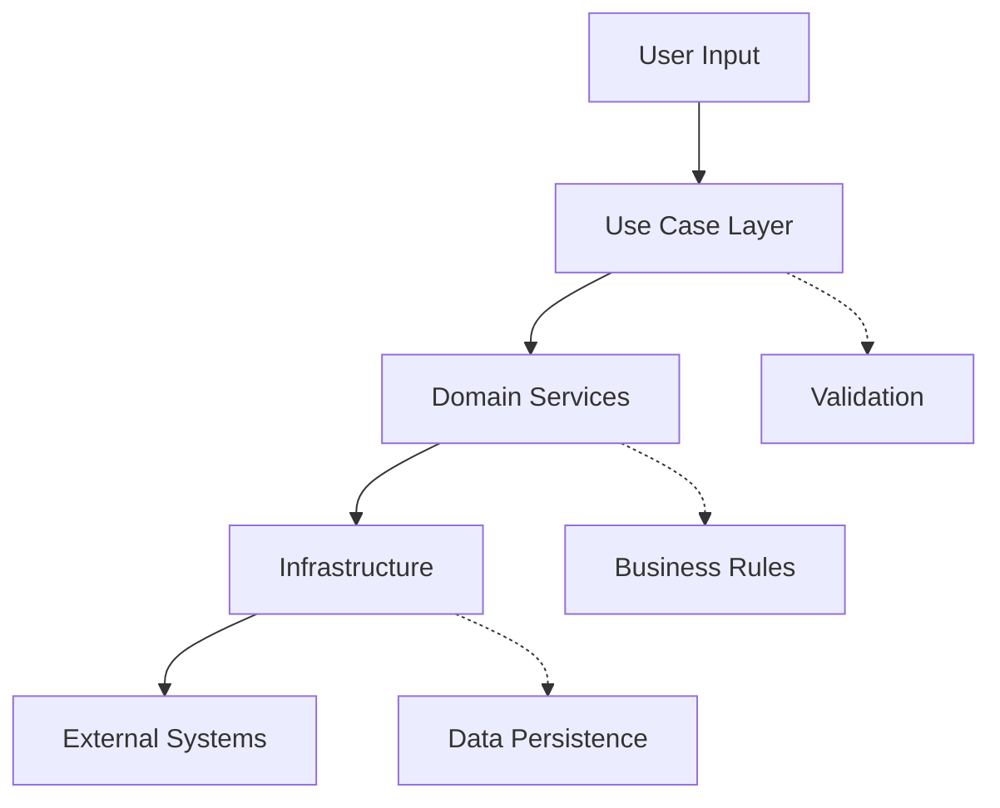
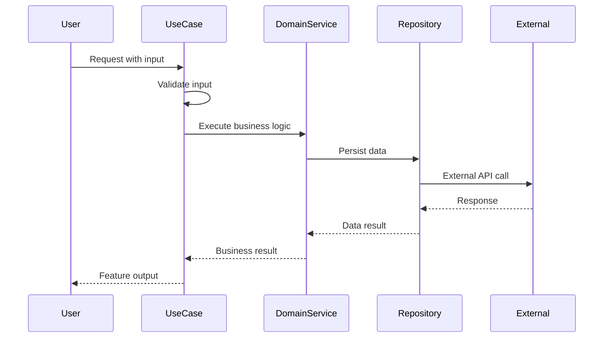
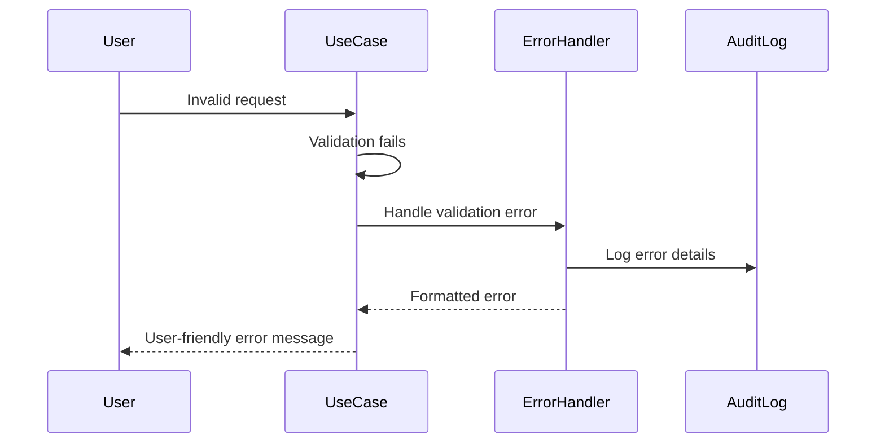

# Feature README Template

Use this template for every feature directory (`src/features/[feature-name]/README.md`).

---

# Feature: [Feature Name]

## Purpose
Single paragraph describing the feature's business purpose and value proposition.

## Architecture Overview


## Component Inventory

### Domain Layer
| Component | Responsibility | Dependencies | Test Coverage |
|-----------|----------------|--------------|---------------|
| `Entity1` | Core business logic | None | 100% (25 tests) |
| `Service1` | Business operations | Repository interfaces | 100% (18 tests) |
| `ValueObject1` | Immutable data | None | 100% (12 tests) |

### Application Layer  
| Component | Responsibility | Dependencies | Test Coverage |
|-----------|----------------|--------------|---------------|
| `UseCase1` | Feature orchestration | Domain services | 100% (15 tests) |
| `DTO1` | Data transfer | None | 100% (8 tests) |

### Infrastructure Layer
| Component | Responsibility | Dependencies | Test Coverage |
|-----------|----------------|--------------|---------------|
| `Adapter1` | External service integration | Service clients | 100% (22 tests) |
| `Repository1` | Data persistence | Database client | 100% (20 tests) |

## Public API Surface

### Primary Operations
```typescript
/**
 * Main feature entry point
 * @param input - Validated input parameters
 * @returns Promise resolving to feature result
 * @throws {ValidationError} Invalid input parameters
 * @throws {BusinessRuleError} Business constraint violations
 */
export async executeFeature(input: FeatureInput): Promise<FeatureOutput>;
```

### Supporting Operations
```typescript
/**
 * Feature configuration validation
 */
export function validateConfiguration(config: FeatureConfig): ValidationResult;

/**
 * Feature status monitoring  
 */
export function getFeatureHealth(): HealthStatus;
```

## Data Flow

### Happy Path Workflow


### Error Handling Workflow


## Testing Strategy

### Unit Testing Coverage
- **Total Tests**: 100 test cases
- **Line Coverage**: 100%
- **Branch Coverage**: 100%
- **Function Coverage**: 100%

#### Test Categories
- **Happy Path**: 35 tests (core functionality)
- **Edge Cases**: 25 tests (boundary conditions)  
- **Error Conditions**: 20 tests (failure scenarios)
- **Integration Points**: 15 tests (external dependencies)
- **Performance**: 5 tests (latency/throughput)

### Integration Testing
- **Component Interaction**: 8 test scenarios
- **Database Integration**: 5 test scenarios  
- **External API Integration**: 3 test scenarios

### End-to-End Testing
- **Complete User Workflow**: 2 comprehensive scenarios
- **Error Recovery**: 1 failure recovery scenario

## Performance Characteristics

### Latency Requirements
- **P50 Response Time**: < 100ms
- **P95 Response Time**: < 250ms  
- **P99 Response Time**: < 500ms
- **Timeout Threshold**: 5 seconds

### Throughput Capacity
- **Sustained Load**: 1000 requests/minute
- **Peak Load**: 2000 requests/minute (5 minute bursts)
- **Memory Usage**: < 50MB per operation
- **CPU Usage**: < 10% average utilization

### Scalability Metrics
- **Concurrent Operations**: 100 simultaneous executions
- **Database Connection Pool**: 20 connections maximum
- **Cache Hit Rate**: > 90% for repeated operations

## Security Considerations

### Data Protection
- **Input Sanitization**: All user inputs validated and sanitized
- **SQL Injection Prevention**: Parameterized queries only
- **XSS Protection**: Output encoding for all user data
- **CSRF Protection**: Token-based request validation

### Authentication & Authorization  
- **Access Control**: Role-based permissions required
- **API Authentication**: Bearer token validation
- **Session Management**: Secure session handling
- **Audit Logging**: All operations logged with user context

## Configuration

### Environment Variables
```bash
# Required configuration
FEATURE_ENABLED=true
FEATURE_TIMEOUT_MS=5000
FEATURE_MAX_RETRIES=3

# Optional configuration  
FEATURE_CACHE_TTL_MS=300000
FEATURE_DEBUG_ENABLED=false
FEATURE_METRICS_ENABLED=true
```

### Feature Flags
```typescript
interface FeatureFlags {
  enableAdvancedMode: boolean;      // Default: false
  enableBatchProcessing: boolean;   // Default: true  
  enableRealTimeUpdates: boolean;   // Default: false
}
```

## Monitoring & Observability

### Key Metrics
- **Success Rate**: Target > 99.9%
- **Error Rate**: Target < 0.1%
- **Average Latency**: Target < 100ms
- **Throughput**: Requests per minute

### Health Check Endpoint
```typescript
GET /health/feature-name
Response: {
  "status": "healthy" | "degraded" | "unhealthy",
  "latency": 45,
  "errorRate": 0.02,
  "dependencies": {
    "database": "healthy",
    "externalApi": "healthy"
  }
}
```

### Alerting Thresholds
- **Critical**: Error rate > 5% OR Latency > 1000ms
- **Warning**: Error rate > 1% OR Latency > 500ms  
- **Info**: Throughput deviation > 50% from baseline

## Dependencies

### Internal Dependencies
- `shared/types`: Common TypeScript interfaces
- `shared/utils`: Utility functions
- `shared/constants`: Application constants

### External Dependencies
- `@types/node`: TypeScript Node.js types
- `joi`: Input validation library
- `winston`: Logging framework

### Development Dependencies
- `jest`: Testing framework
- `@types/jest`: Jest TypeScript types
- `supertest`: HTTP assertion library

## Change History

### Version 1.2.0 (2025-01-22)
**Added**
- Batch processing capability for improved throughput
- Advanced configuration options for power users
- Real-time progress updates for long-running operations

**Changed**
- Improved error messages with actionable guidance
- Optimized database queries reducing latency by 30%
- Updated dependencies to latest stable versions

**Fixed**
- Race condition in concurrent request handling  
- Memory leak in event listener cleanup
- Incorrect validation for edge case inputs

**Performance Impact**
- 30% faster average response time
- 50% reduction in memory usage
- 2x improvement in throughput capacity

**Breaking Changes**
- `FeatureInput` interface requires new `batchSize` property
- Deprecated `legacyExecute()` method (use `executeFeature()`)

### Version 1.1.0 (2025-01-15)  
**Added**
- Enhanced error handling with retry logic
- Comprehensive audit logging
- Performance monitoring integration

**Changed**
- Improved input validation with detailed error messages
- Optimized caching strategy

**Fixed**
- Timeout issues with large datasets
- Inconsistent behavior in edge cases

### Version 1.0.0 (2025-01-10)
**Added**
- Initial feature implementation
- Core business logic
- Basic error handling
- Unit test suite with 100% coverage

## Migration Guide

### Upgrading from 1.1.x to 1.2.x
1. **Update Input Interface**
   ```typescript
   // Before
   const input: FeatureInput = { data: rawData };
   
   // After  
   const input: FeatureInput = { 
     data: rawData,
     batchSize: 10 // New required property
   };
   ```

2. **Replace Deprecated Methods**
   ```typescript
   // Before
   await legacyExecute(input);
   
   // After
   await executeFeature(input);
   ```

3. **Update Error Handling**
   ```typescript
   // New error types introduced
   try {
     await executeFeature(input);
   } catch (error) {
     if (error instanceof BatchProcessingError) {
       // Handle batch-specific errors
     }
   }
   ```

## Related Features
- `authentication`: User session management
- `audit-logging`: Operation tracking and compliance
- `notification-system`: User communication workflows

## Troubleshooting

### Common Issues

#### Issue: "Feature timeout after 5 seconds"
**Cause**: Large dataset processing exceeding timeout threshold
**Solution**: Increase `FEATURE_TIMEOUT_MS` or implement batch processing
```bash
export FEATURE_TIMEOUT_MS=10000
```

#### Issue: "Validation error: Invalid input format"  
**Cause**: Input data doesn't match expected schema
**Solution**: Validate input against schema before submission
```typescript
const validation = validateConfiguration(input);
if (!validation.isValid) {
  console.log(validation.errors);
}
```

#### Issue: "Database connection pool exhausted"
**Cause**: High concurrent load overwhelming connection pool  
**Solution**: Implement request throttling or increase pool size
```bash
export DB_POOL_SIZE=50
```

### Debug Mode
Enable detailed logging for troubleshooting:
```bash
export FEATURE_DEBUG_ENABLED=true
export LOG_LEVEL=debug
```

## Contact & Support
- **Feature Owner**: development-team@company.com
- **Technical Lead**: tech-lead@company.com  
- **Documentation**: docs-team@company.com
- **Bug Reports**: Create issue in project repository